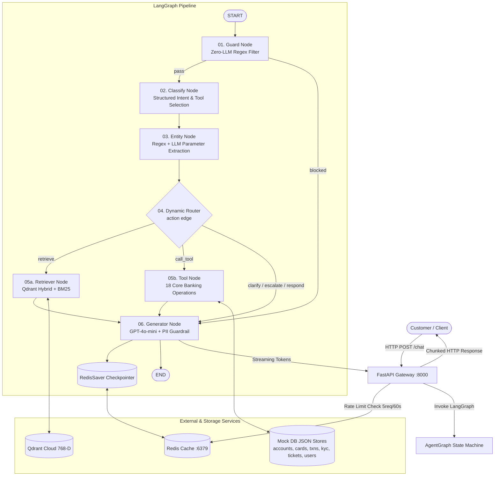

# NexaBank AI — Intelligent Customer Support Agent

[](https://www.python.org/)
[](https://fastapi.tiangolo.com/)
[](https://langchain-ai.github.io/langgraph/)
[](https://qdrant.tech/)
[](https://redis.io/)
[](https://nextjs.org/)

An enterprise-grade, deterministic agentic support system for retail banking. Powered by **LangGraph state graphs**, **Hybrid RAG (Qdrant + BM25)**, **Redis multi-turn memory checkpointers**, and **18 mock core-banking tools**.

---

## 1. Project Overview

NexaBank AI is an autonomous, production-oriented customer support engine designed specifically for retail banking institutions. It handles everyday banking customer requests including account balance lookups, emergency card freezes, failed transaction root-cause troubleshooting, KYC verification guidance, dispute ticket creation, and regulatory policy questions (NPCI UPI guidelines, NEFT cutoff timings, RBI chargeback rules).

### Problem Statement
Traditional rule-based banking chatbots are brittle, unable to maintain multi-turn context (e.g., remembering which account was referenced when the user says "block my card"), and prone to failure when complex intent routing is needed. Conversely, naive generative LLM wrappers suffer from hallucinations, high latency, security vulnerabilities (prompt injection), and lack deterministic state control.

### Solution
NexaBank AI solves this with a **deterministic 6-node LangGraph state machine**:
1. **Zero-LLM Guardrail Node**: Rejects prompt injections and off-topic chatter with 0ms LLM overhead.
2. **Structured Intent Classifier**: Categorizes requests, determines priority, and selects appropriate tools or RAG actions.
3. **Deterministic Entity Extractor**: Pulls banking identifiers (`ACC-`, `CRD-`, `TXN-`, `CASE-`, `user_`) with regex fallbacks and reuses session state.
4. **Hybrid RAG Engine**: Combines 768-D dense vector embeddings (`BAAI/bge-base-en-v1.5`) via Qdrant Cloud with sparse BM25 lexical keyword matching (0.5 / 0.5 ensemble).
5. **Core-Banking Tool Layer**: Executes atomic reads and disk-persisted mutations across 6 banking domains.
6. **Grounded Generator with PII Masking**: Synthesizes verified answers strictly grounded in retrieved documents or tool results, masking full PAN, PIN, and OTP.

---

## 2. Main Features

- **Multi-Turn Context Persistence**: Backed by `RedisSaver` checkpoints. Follow-up phrases like *"What about its recent transactions?"* or *"Block that card"* resolve automatically.
- **Deterministic Prompt Injection Guard**: Pattern-based security shield intercepting adversarial inputs without calling the LLM.
- **Hybrid Vector + Keyword Search**: Dense semantic search combined with sparse lexical search to reliably retrieve exact banking clauses, fees, and past resolved cases.
- **18 Atomic Banking Tools**:
  - **Account Tools**: Balance inquiry, account details, recent transactions, spending summary.
  - **Card Tools**: Card status lookup, emergency card freeze, report lost/stolen, replacement order.
  - **Transaction Tools**: Transaction status, failure diagnostics, pending transfer tracking, duplicate check.
  - **KYC Tools**: Verification status, missing document checklist, customer tier lookup.
  - **Dispute & Case Tools**: Case status check, past resolved case lookup, customer dispute creation.
  - **User Tools**: Customer profile retrieval, registered email lookup.
- **Token Streaming HTTP API**: FastAPI endpoint streaming text chunks directly to clients.
- **Sliding-Window Rate Limiting**: Redis middleware limiting requests to 5 requests per 60 seconds per thread or IP.
- **Comprehensive Quality Evaluation**: DeepEval evaluation suite measuring Answer Relevancy, Hallucination, and Contextual Precision with an LLM Judge.

---

## 3. Technology Stack

| Layer | Technologies |
|---|---|
| **Frontend Clients** | • Next.js 16 (React 19, TypeScript, Framer Motion)<br>• Streamlit 1.x (Alternative Python UI) |
| **Backend API** | • FastAPI 0.115<br>• Uvicorn ASGI Server<br>• Starlette Middleware |
| **Agent Framework** | • LangGraph 0.3 (StateGraph, Conditional Edges)<br>• LangChain Core / Community |
| **Vector Database & Search** | • Qdrant Cloud (Cosine Similarity, 768-D)<br>• Rank-BM25 (Sparse lexical search)<br>• LangChain EnsembleRetriever (0.5 / 0.5 weights) |
| **Embedding Model** | • `BAAI/bge-base-en-v1.5` (HuggingFace Embeddings) |
| **LLM Engine** | • OpenAI `gpt-4o-mini` (Structured Outputs & Grounded Generation) |
| **State Memory & Checkpointing** | • Redis Stack 7.2 (`langgraph-checkpoint-redis` via `RedisSaver`) |
| **Testing & Evaluation** | • Pytest (Unit & Integration tests)<br>• DeepEval (LLM evaluation metrics) |
| **Observability & Tracing** | • Langfuse (Optional distributed tracing) |
| **Infrastructure** | • Docker & Docker Compose |

---

## 4. Architecture Diagram



---

## 5. Project Structure

```
.
├── app/
│   ├── agents/
│   │   ├── nodes/
│   │   │   ├── guard_node.py          # Zero-LLM injection & keyword filter
│   │   │   ├── classify_node.py       # Structured intent & action classifier
│   │   │   ├── entity_node.py         # Account/card/case parameter extractor
│   │   │   ├── retriever_node.py      # Qdrant + BM25 hybrid search caller
│   │   │   ├── tool_node.py           # Core-banking tool execution dispatcher
│   │   │   └── generater_node.py      # Grounded LLM generator with PII masking
│   │   ├── tools/
│   │   │   ├── account_tool.py        # Balances, spending & statement tools
│   │   │   ├── card_tool.py           # Card status, freeze & replacement tools
│   │   │   ├── transaction_tool.py    # Status, failure analysis & duplicate checks
│   │   │   ├── kyc_tool.py            # KYC status & missing document tools
│   │   │   ├── ticket_tool.py         # Dispute creation & ticket lookup tools
│   │   │   ├── user_tool.py           # Customer profile tools
│   │   │   └── persist.py             # Atomic JSON file writer for state mutations
│   │   ├── graph.py                   # StateGraph assembly & Redis checkpointer
│   │   ├── router.py                  # Conditional edge router function
│   │   ├── session_context.py         # Multi-turn context serializer
│   │   └── state.py                   # TypedDict Agentstate definition
│   ├── common/
│   │   ├── custom_exception.py        # Centralized exception wrapper
│   │   └── logger.py                  # Standardized logging configuration
│   ├── config/
│   │   └── config.py                  # Environment variables & path constants
│   ├── middleware/
│   │   └── rate_limiter.py            # Sliding-window Redis rate limiting middleware
│   ├── prompts/
│   │   ├── classify_prompt.py         # Intent classification prompt template
│   │   ├── entity_prompt.py           # Entity extraction prompt template
│   │   └── generate_prompt.py         # Grounded generation prompt template
│   ├── rag/
│   │   ├── bm25.py                    # BM25 sparse keyword retriever
│   │   ├── chunk.py                   # Recursive text chunking (500 chars / 100 overlap)
│   │   ├── embedding.py               # BGE-base-en-v1.5 embedding loader
│   │   ├── generate.py                # LangChain generation chain wrapper
│   │   ├── llm.py                     # ChatOpenAI factory with temperature=0
│   │   ├── loader.py                  # Policy markdown & resolved ticket loader
│   │   ├── qdrant.py                  # Qdrant client, collection creation & indexing
│   │   └── retriever.py               # EnsembleRetriever combining dense & BM25
│   ├── schema/
│   │   ├── classify.py                # Pydantic schema for classification output
│   │   └── entity.py                  # Pydantic schema for entity extraction
│   ├── api.py                         # FastAPI backend application & /chat route
│   └── main.py                        # Streamlit chat application
├── support-agent-data/
│   ├── knowledge_base/                # Markdown banking policy documents
│   │   ├── account_security_policy.md
│   │   ├── card_policy.md
│   │   ├── charges_fees_policy.md
│   │   ├── faqs.md
│   │   ├── fraud_dispute_policy.md
│   │   ├── kyc_policy.md
│   │   ├── refund_policy.md
│   │   ├── transaction_policy.md
│   │   ├── upi_policy.md
│   │   └── past_tickets/resolved_tickets.json
│   └── mock_db/                       # Core banking JSON seed databases
│       ├── accounts.json
│       ├── cards.json
│       ├── kyc.json
│       ├── tickets.json
│       ├── transactions.json
│       └── users.json
├── tests/
│   ├── eval_dataset.json              # 50 golden banking test scenarios
│   ├── evaluate_quality.py            # DeepEval LLM judge evaluation script
│   ├── node_eval_results.json         # Per-node accuracy benchmarks
│   └── test_banking_static.py         # Static regression & integration test suite
├── web/                               # Next.js 16 Web Application
│   ├── src/app/                       # App router pages & API proxy
│   └── src/components/                # UI components & Live Chat Copilot
├── docker-compose.yml                 # Multi-container orchestration (Redis, API, UI)
├── Dockerfile                         # Container definition for Python stack
├── requirements.txt                   # Python dependencies
└── README.md                          # Project documentation
```

---

## 6. Setup & Local Development

### Prerequisites
- Python 3.11 or 3.12
- Node.js 18+ (for Next.js web application)
- Docker & Docker Compose
- OpenAI API Key
- Qdrant Cloud Cluster URL & API Key

### Environment Configuration
Copy the example environment file and fill in your API credentials:
```bash
cp .env.example .env
```
Ensure your `.env` contains:
```ini
OPENAI_API_KEY=sk-...
OPENAI_MODEL_NAME=gpt-4o-mini
OPENAI_EVAL_MODEL=gpt-4o-mini

QDRANT_URL=https://your-cluster-id.qdrant.tech:6333
QDRANT_API_KEY=your-qdrant-api-key

REDIS_URL=redis://localhost:6379
LANGFUSE_ENABLED=false
```

### Running with Docker Compose (Recommended)
```bash
docker compose up --build -d
```
Services will be available at:
- **FastAPI Backend**: `http://localhost:8000`
- **FastAPI Health Check**: `http://localhost:8000/health`
- **Streamlit Client**: `http://localhost:8501`
- **RedisInsight UI**: `http://localhost:8001`

### Running Locally without Docker

1. **Start Redis**:
   ```bash
   redis-server
   ```

2. **Setup Python Virtual Environment & Install Dependencies**:
   ```bash
   python3 -m venv venv
   source venv/bin/activate
   pip install --upgrade pip
   pip install torch torchvision torchaudio --index-url https://download.pytorch.org/whl/cpu
   pip install -r requirements.txt
   ```

3. **Start FastAPI Backend**:
   ```bash
   uvicorn app.api:app --host 0.0.0.0 --port 8000 --reload
   ```

4. **Start Next.js Frontend**:
   ```bash
   cd web
   npm install
   npm run dev -- --port 3001
   ```
   Open `http://localhost:3001` to use the interactive Banking Assistant.

---

## 7. Testing & Quality Evaluation

### 1. Static & Functional Tests (Pytest)
Runs deterministic checks verifying mock DB integrity, text chunking, tool node dispatching, user resolution, and security guardrail blocking:
```bash
pytest tests/test_banking_static.py -v
```

### 2. DeepEval Quality Evaluation (LLM Judge)
Evaluates 50 production queries across Answer Relevancy, Hallucination, and Contextual Precision:
```bash
python tests/evaluate_quality.py
```
Outputs detailed per-node accuracy metrics to `tests/node_eval_results.json`.

---

## 8. Security & Guardrails

- **Zero-LLM Input Screening**: Regex detection of prompt injection patterns (`ignore previous instructions`, `dan mode`, `jailbreak`) before LLM invocation.
- **PII & Data Masking**: Strict system prompt constraints preventing the generation of full PAN, CVV, PIN, or OTP in responses.
- **Sliding-Window Rate Limiter**: 5 requests per 60 seconds per thread/IP via Redis middleware (`app/middleware/rate_limiter.py`).
- **Grounded Responses**: The generator is constrained to answer exclusively using tool execution results or retrieved policy documents.

---

## 9. Limitations & Future Improvements

### Current Limitations
- **Mock DB Layer**: Banking data is stored in local JSON files rather than an ACID-compliant relational database (PostgreSQL).
- **Synchronous Graph Execution**: Node transitions run in a synchronous loop before streaming tokens at the HTTP layer.
- **No KYC File Ingestion**: Missing KYC documents cannot be uploaded in chat; customers are given procedural checklists.

### Production Roadmap
- Connect tools to real Core-Banking Systems (Finacle/TCS BaNCS/Mambu) via mTLS REST APIs.
- Migrate JSON checkpointer to Redis Enterprise with automated TTL cleanup.
- Introduce bi-directional WebSocket support with client-side speech transcription.
- Implement automated human agent handoff via webhook queues when `action: "escalate"`.
