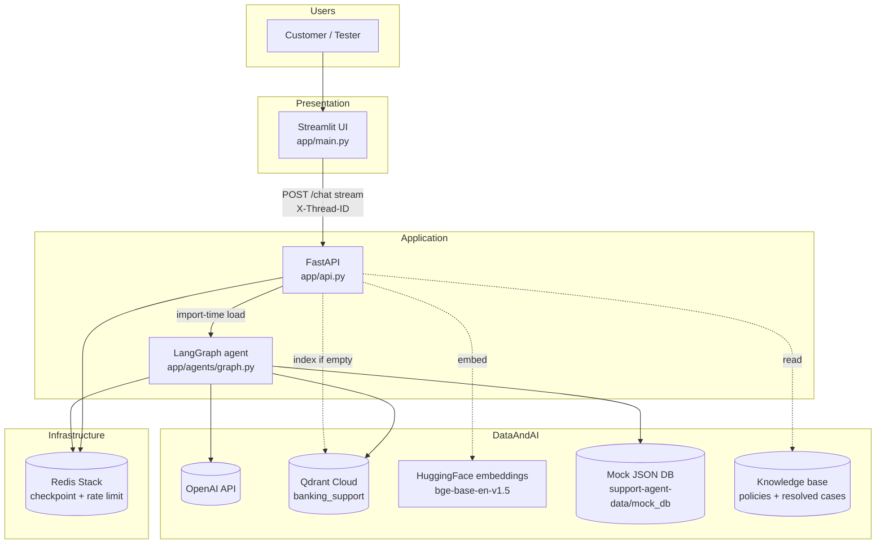
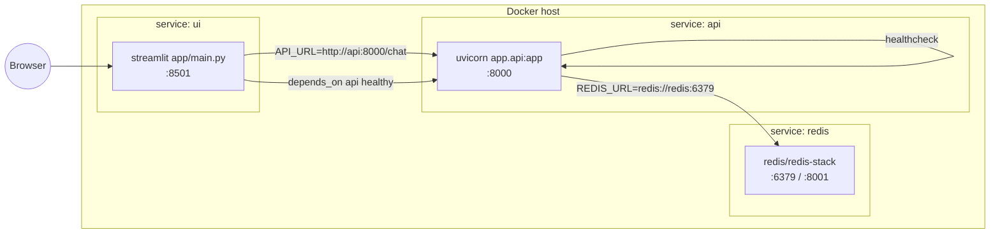
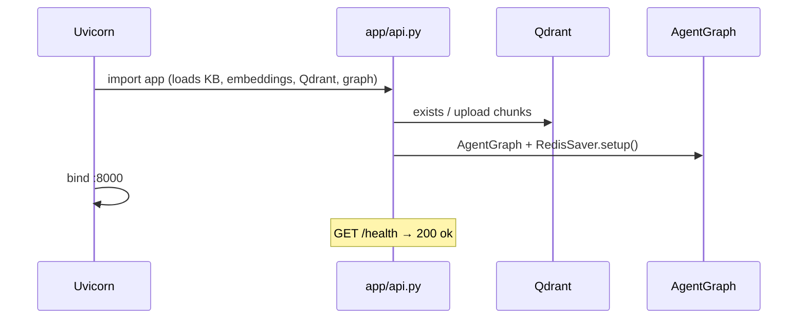
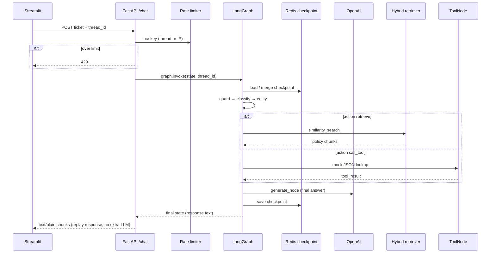
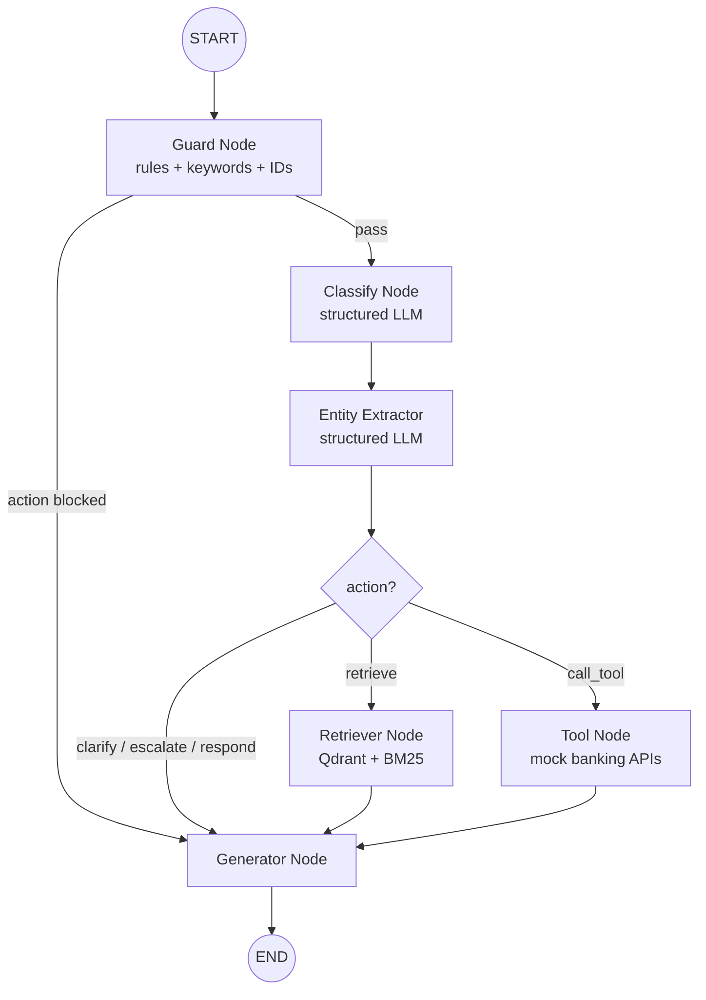
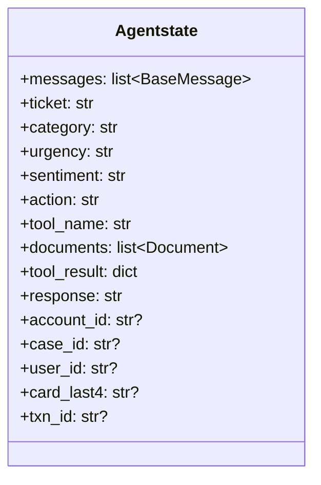
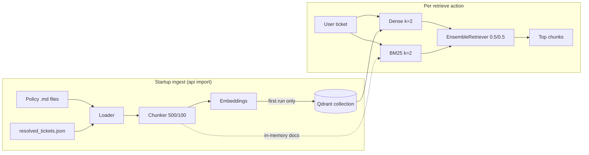
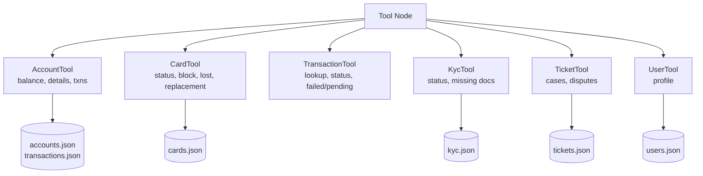
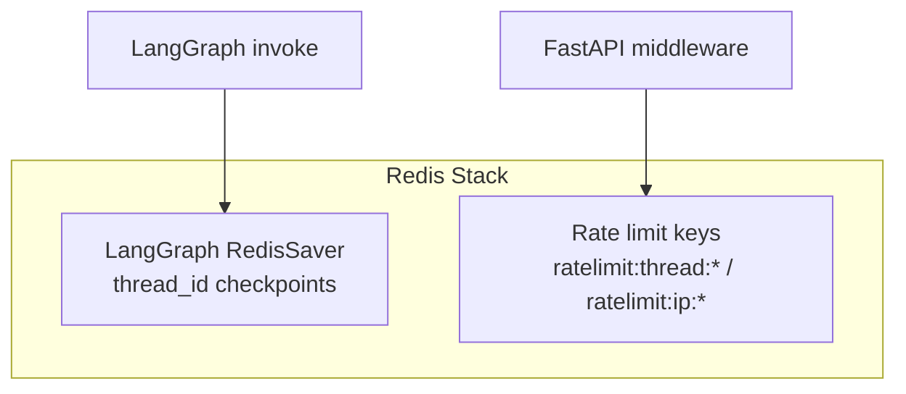
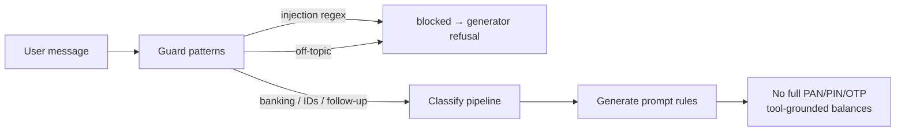

# System Architecture — Intelligent Banking Assistant

This document describes how components connect, how a chat request flows end-to-end, and how LangGraph state is checkpointed in Redis. All diagrams use **Mermaid**.

← [Back to README](README.md)

---

## 1. System context

---

## 2. Deployment (Docker Compose)

| Container | Role |
|-----------|------|
| `support_redis` | LangGraph `RedisSaver`, rate-limit counters, RedisInsight on 8001 |
| `support_api` | Loads RAG + graph in a background thread; exposes `/health` and `/chat` |
| `support_ui` | Chat UI; one UUID `thread_id` per conversation |

---

## 3. API startup sequence

All RAG and graph setup runs **when `app.api` is imported** (before Uvicorn listens). Until that finishes, nothing is bound on port 8000.

---

## 4. Chat request sequence (single turn)

The graph runs once per message (classify + entity + **one** generate LLM call). The HTTP layer **chunks** `result["response"]` for the UI stream—no second LLM call.

---

## 5. LangGraph agent flow

**Guard** (no LLM): blocks prompt-injection patterns and off-topic messages; allows banking keywords, banking IDs (`ACC-`, `CRD-`, `TXN-`, `CASE-`), `user_<n>`, and short follow-ups.

**Router** (`app/agents/router.py`): returns `state["action"]` as the next edge name.

---

## 6. Agent state (`Agentstate`)

Checkpointed per `thread_id` in Redis (messages + banking IDs persist across turns).

| Field | Set by | Purpose |
|-------|--------|---------|
| `messages` | Each turn (`HumanMessage` + `AIMessage`) | Classify / entity / generate history |
| `account_id`, `card_last4`, … | Entity node (+ regex fallbacks) | Tool args and session context |
| `documents` | Retriever | Policy text for RAG answers |
| `tool_result` | Tool node | Balances, card rows, KYC JSON |
| `action`, `tool_name` | Classify | Routing |

`format_session_context()` injects known IDs into classify and entity prompts for follow-ups (“my card”, “user_3” only, etc.).

---

## 7. Hybrid RAG pipeline

Collection name: **`banking_support`** (768-d vectors).

---

## 8. Tool layer (mock core banking)

**Clarify path:** if a required ID is missing, Tool node sets `action: clarify` instead of failing.

**Account → card linking:** `card_status` with only `account_id` uses `cards_for_account()` (single active card auto-selected).

**Account → user for KYC:** `resolve_user_id()` reads `user_id` from state or from `get_account_details(account_id)`.

**Writes:** `persist.save_json()` updates `cards.json` / `tickets.json` for block, replacement, new dispute case (`mutation: true` in tool result).

---

## 9. Classify actions and tools

| `action` | Next node | When |
|----------|-----------|------|
| `retrieve` | Retriever | Policies, FAQs, fees, UPI rules |
| `call_tool` | Tool | Live mock data (balance, card, txn, KYC, case) |
| `clarify` | Generator | Ask for missing ID |
| `escalate` | Generator | Fraud / legal / human handoff |
| `respond` | Generator | Greetings, generic reply |

| Tool group | Names |
|------------|--------|
| Account | `get_balance`, `get_account_details`, `recent_transactions`, `spending_summary` |
| Card | `card_status`, `block_card`, `report_lost_stolen`, `card_replacement` |
| Transaction | `transaction_lookup`, `transaction_status`, `failed_transaction`, `pending_transaction`, `duplicate_transaction` |
| KYC | `kyc_status`, `missing_kyc_documents`, `kyc_verification_status` |
| Case / user | `check_case_status`, `get_case`, `create_dispute_case`, `get_user` |

Legacy aliases: `check_ticket_status` → `check_case_status`, `get_ticket` → `get_case`.

---

## 10. Redis usage

| Concern | Implementation |
|---------|----------------|
| Conversation memory | `RedisSaver(REDIS_URL)` + `configurable.thread_id` |
| Rate limiting | `RateLimitMiddleware` — 5 req / 60s on `/chat` |
| Why Redis Stack | RediSearch indexes required by `langgraph-checkpoint-redis` |

LangChain `ConversationBufferMemory` is **not** used; the full `Agentstate` is checkpointed instead.

---

## 11. Security and guardrails

- Optional **Langfuse** callbacks on `/chat` when enabled.
- Mock data only — no real core banking integration.

---

## 12. File map (runtime-critical)

| Path | Responsibility |
|------|----------------|
| `app/api.py` | Loads KB, Qdrant, graph on import; `/health`, `/chat` streaming |
| `app/agents/graph.py` | Graph compile + `run(ticket, thread_id)` |
| `app/agents/nodes/*` | Pipeline nodes |
| `app/rag/retriever.py` | Hybrid ensemble |
| `app/middleware/rate_limiter.py` | Redis rate limits |
| `app/main.py` | Streamlit UI |

---

## 13. Extension points

- Add tools in `app/agents/tools/` and wire names in `tool_node.py`, `classify_prompt.py`.
- Add policies under `support-agent-data/knowledge_base/` and re-index Qdrant (or bump collection).
- Replace `RedisSaver` with Postgres checkpoint for long-term audit (heavier ops).
- Optional: merge classify + entity into one structured LLM call (latency/cost).
- Optional: true token streaming from a single `stream()` inside `generate_node` while accumulating text for Redis checkpoint.
