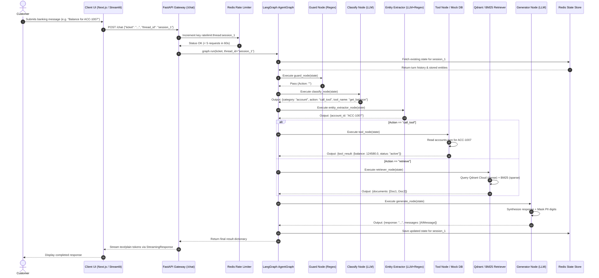

# Data & API Flow — NexaBank AI

This document provides complete documentation on how data moves through the application, API endpoint definitions, mock database schemas, and external service integrations.

---

## 1. Data Movement & Transformation Lifecycle



---

## 2. API Endpoint Documentation

### 2.1 `GET /health`
- **Method**: `GET`
- **Path**: `/health`
- **Purpose**: Readiness and liveness probe. Returns 200 OK after graph compilation and vector store initialization.
- **Request Parameters**: None.
- **Headers**: None.
- **Response**:
  ```json
  {
    "status": "ok",
    "service": "banking-assistant-api"
  }
  ```
- **Status Codes**: `200 OK`.
- **Frontend Caller**: Checked by Next.js `Navbar.tsx` and Docker Compose healthcheck.

---

### 2.2 `POST /chat`
- **Method**: `POST`
- **Path**: `/chat`
- **Purpose**: Primary conversational endpoint. Ingests customer query, invokes LangGraph state machine with Redis multi-turn persistence, and streams grounded text chunks back to the caller.
- **Request Headers**:
  - `Content-Type: application/json`
  - `X-Thread-ID: <session_uuid>` (Optional; used for rate-limiting before parsing body)
- **Request Body**:
  ```json
  {
    "ticket": "What is the balance for account ACC-1007?",
    "thread_id": "session_user_123"
  }
  ```
- **Validation**: `ticket` must be non-empty string, `thread_id` must be string.
- **Rate Limit**: 5 requests per 60-second window per `thread_id` or client IP. Returns HTTP 429 when exceeded.
- **Response**: Chunked stream (`media_type="text/plain"`):
  ```
  Your available balance for account ACC-1007 is ₹1,24,580.00 INR. Status: Active.
  ```
- **Error Responses**:
  - `429 Too Many Requests`: `{"error": "Too many requests! Please slow down.", "retry_after_seconds": 45}`
  - `500 Internal Server Error`: `Internal Server Error details: <traceback>`
- **Frontend Caller**: `app/main.py` (Streamlit write_stream), `web/src/components/LiveChatCopilot.tsx` (Next.js fetch stream reader).

---

## 3. Mock Database Schemas (`support-agent-data/mock_db/`)

The core banking layer stores relational customer and account records as structured JSON files.

### 3.1 `accounts.json`
Represents customer deposit accounts.
```json
{
  "ACC-1007": {
    "user_id": "user_7",
    "account_type": "savings",
    "balance": 124580.0,
    "currency": "INR",
    "status": "active",
    "branch": "Bengaluru Main",
    "ifsc": "NXBK0001007",
    "opened_on": "2021-06-15"
  }
}
```

### 3.2 `cards.json` (Supports Live Mutations)
Represents debit and credit cards issued to accounts. Mutated live by `block_card`, `report_lost_stolen`, and `card_replacement`.
```json
{
  "CRD-7007": {
    "account_id": "ACC-1007",
    "user_id": "user_7",
    "card_type": "debit",
    "network": "Visa",
    "tier": "Platinum",
    "last4": "4521",
    "status": "active",
    "expiry": "12/2028",
    "daily_limit": 100000.0,
    "international_enabled": false,
    "blocked_on": null,
    "reported_lost_stolen": false,
    "replacement_status": null
  }
}
```

### 3.3 `transactions.json`
Represents payment and settlement records.
```json
{
  "TXN-9025": {
    "account_id": "ACC-1007",
    "user_id": "user_7",
    "channel": "UPI",
    "amount": 2400.0,
    "currency": "INR",
    "status": "failed",
    "timestamp": "2026-09-28 14:32:10",
    "merchant": "Swiggy",
    "utr": "UTR992817263",
    "failure_reason": "Insufficient funds at time of processing"
  }
}
```

### 3.4 `kyc.json`
Represents regulatory KYC compliance profiles.
```json
{
  "user_7": {
    "kyc_status": "FULL_KYC",
    "tier": "Tier-3",
    "pan_verified": true,
    "aadhaar_verified": true,
    "verified_on": "2025-03-14",
    "next_review_on": "2027-03-14",
    "missing_documents": []
  }
}
```

### 3.5 `tickets.json` (Supports Live Mutations)
Represents dispute tickets and support cases. Mutated live by `create_dispute_case`.
```json
{
  "CASE-3001": {
    "ticket_id": "CASE-3001",
    "user_id": "user_7",
    "account_id": "ACC-1007",
    "status": "in_review",
    "category": "dispute",
    "sub_category": "unauthorized_transaction",
    "priority": "high",
    "created_on": "2026-09-22",
    "assigned_team": "fraud_desk",
    "expected_resolution": "2026-10-06"
  }
}
```

### 3.6 `users.json`
Represents customer identity and contact information.
```json
{
  "user_7": {
    "name": "Rajesh Kumar",
    "email": "rajesh.kumar@email.com",
    "phone": "+91-98765-43210",
    "member_since": "2021-06-15",
    "linked_accounts": ["ACC-1007"]
  }
}
```

---

## 4. External Services & Cloud Integrations

| Service | Purpose | Where Connected | Authentication | Error Handling |
|---|---|---|---|---|
| **OpenAI API** | • Structured classification (`gpt-4o-mini`)<br>• Entity extraction (`gpt-4o-mini`)<br>• Grounded answer generation (`gpt-4o-mini`)<br>• Evaluation judge (`OPENAI_EVAL_MODEL`) | `app/rag/llm.py`<br>`app/agents/nodes/classify_node.py`<br>`app/agents/nodes/entity_node.py`<br>`app/agents/nodes/generater_node.py` | `OPENAI_API_KEY` from `.env` | Handled via try/except in node functions; raises `CustomException`. Evaluator has exponential backoff for 429 rate limits. |
| **Qdrant Cloud** | • Vector similarity search over 768-D policy embeddings | `app/rag/qdrant.py`<br>`app/rag/retriever.py` | `QDRANT_URL`<br>`QDRANT_API_KEY` from `.env` | Startup verification check in `app/api.py`. Raises `RuntimeError` if unreachable. |
| **Redis Stack 7.2** | • Multi-turn `Agentstate` checkpointer (`RedisSaver`)<br>• Sliding-window rate limiter counter (5 req / 60s) | `app/agents/graph.py`<br>`app/middleware/rate_limiter.py` | `REDIS_URL` (default: `redis://localhost:6379`) | `memory.setup()` creates RediSearch indexes. Middleware falls back to client IP if thread header is missing. |
| **HuggingFace Embeddings** | • Local sentence embedding (`BAAI/bge-base-en-v1.5`, 768-D) | `app/rag/embedding.py` | HuggingFace model cache (local / CPU inference) | Wrapped in `CustomException` on load failure. |
| **Langfuse (Optional)** | • Distributed execution tracing of LangGraph hops and token usage | `app/api.py`<br>`tests/evaluate_quality.py` | `LANGFUSE_PUBLIC_KEY`<br>`LANGFUSE_SECRET_KEY`<br>`LANGFUSE_HOST` | Enabled only when `LANGFUSE_ENABLED=true` in `.env`. |
